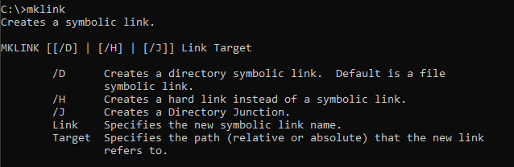
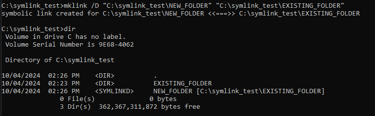

# What are Symlinks?

>A **symlink** or a **Symbolic Link** is simply enough a shortcut to another file. It is a file that points to another file.
>
>*[- What is a Symlink? (devdojo.com)](https://devdojo.com/devdojo/what-is-a-symlink)*

Its possible to create Symlinks between files or directories. The original file or directory is not changed in this process.
# Creating Symlinks

Open cmd as administrator on windows and run the `mklink` command.



Let's say we need to create a link from the *EXISTING_FOLDER* to *NEW_FOLDER*. After the Symlink creation *NEW_FOLDER* will be a shortcut to *EXISTING_FOLDER*.

In this scenario we are creating a directory link so we need to use the */D* argument and pass both the shortcut folder path and the folder that is going to be referenced.

```BASH
mklink /D "VALID/PATH/NEW_FOLDER" "PATH/TO/EXISTING/FOLDER"
```

Example:
```BASH
mklink /D "C:\symlink_test\NEW_FOLDER" "C:\symlink_test\EXISTING_FOLDER"
```

# Checking Symlinks

To check run `dir`, you'll see that *NEW_FOLDER* was created and is a *SYMLINKD*.
Also note that *EXISTING_FOLDER* is still there and is a *DIR*:



Now every file or directory that is created on one of the folders will automatically appear on the other one.
# Removing Symlinks

The Symlink is just a shortcut, so to delete it, just delete the *NEW_FOLDER* shortcut.

>Be careful to not remove the original file or folder.

# Troubleshooting

## Cannot create a file when that file already exists
The *NEW_FOLDER* name should be a folder that doesn't exist yet in that path.

## Access is Denied
Probably you forgot to add `/D` after the `mklink` command.

## The syntax of the command is incorrect.
Did you type `\D` instead of `/D`?

## You do not have sufficient privilege to perform this operation.
You need to open CMD as administrator to execute this command. This also doesn't work on windows new app *Terminal* or *Powershell*. 